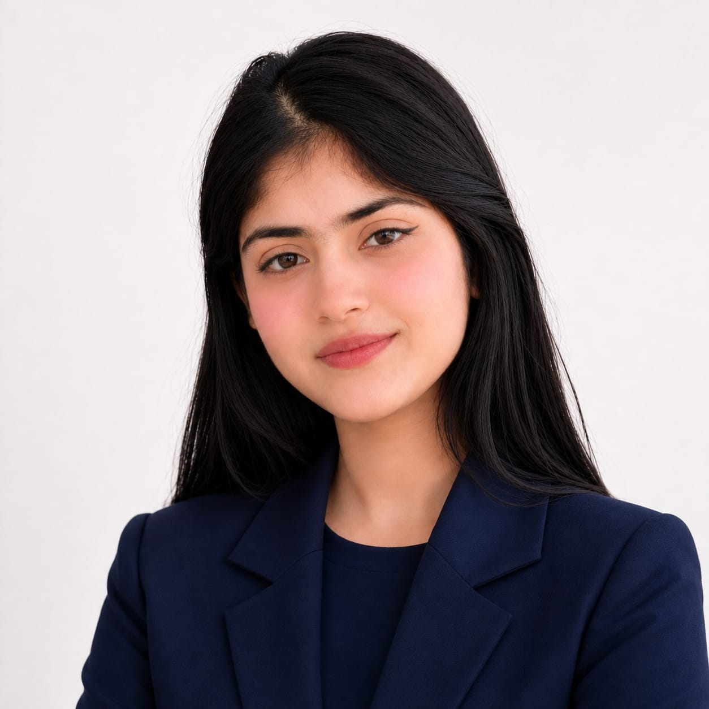

  

  
  
  

  

## 🎓 About Me

I'm a **BS Artificial Intelligence** student at COMSATS University Islamabad, Lahore Campus, currently building my skills in **Python, C++, and software development**.

I like breaking a problem down, working out the logic, and building something that actually runs. Right now I'm strengthening my foundations in **data structures, algorithms, and core AI concepts** — and looking for an internship where I can put that into practice.

- 🤖 BS Artificial Intelligence student
- 💻 Passionate about turning logic into clean, working code
- 📚 Building foundations in Data Structures, Algorithms, and AI concepts
- 🌱 Always learning — one project, one problem at a time

 

## 🛠️ Tech Stack

  

  
  
  

## 📊 GitHub Stats

  
  

  

## 🎓 Education

<table>
<tr>
<td>

**BS Artificial Intelligence**
COMSATS University Islamabad, Lahore Campus · 2nd Semester

</td>
<td align="right">

**CGPA**
3.6 / 4.0

</td>
</tr>
</table>

## 📌 Featured Projects

<table>
<tr>
<td width="50%" valign="top">

### 📚 Library Management System
**C++** · File Handling

A console-based application managing book and member records, with file handling for persistent storage and a menu-driven interface.

[**View Code →**](https://github.com/maryammumtaz340-sys/library-management-system-cpp/blob/main/Library-managment-system.cpp)

</td>
<td width="50%" valign="top">

### 📈 Student Marks Analyzer
**C++** · Arrays · Functions

Processes student marks and generates a performance summary using arrays and modular functions for totals, averages, and grades.

[**View Code →**](https://github.com/maryammumtaz340-sys/student-marks-analyzer-cpp/blob/main/Student-marks-Analyzer.cpp)

</td>
</tr>
<tr>
<td width="50%" valign="top">

### 🐍 Python Mini-Projects
**Python**

A set of small programs — a calculator and data-processing scripts — practicing loops, functions, lists, and conditionals.

[**View Code →**](https://github.com/maryammumtaz340-sys/python-mini-projects)

</td>
<td width="50%" valign="top">

### 🚧 More on the way
Currently building a few more projects, including one exploring core AI concepts.

*Check back soon.*

</td>
</tr>
</table>

## 📬 Let's Connect

  <a href="mailto:maryammumtaz340@gmail.com">📧 maryammumtaz340@gmail.com</a> &nbsp;·&nbsp;
  <a href="https://www.linkedin.com/in/maryam-mumtaz-3a1820425">🔗 LinkedIn</a> &nbsp;·&nbsp;
  <a href="https://maryammumtaz340-sys.github.io">🌐 Portfolio</a>

<em>Thanks for stopping by! ⭐</em>

